Fontastic - Font Showcasing for Pebble
======================================

This font preview app is based off the [app_font_browser] sample app and has been expanded to include many custom fonts and different text messages in each font.

It's published in the Pebble Appstore.  You do not need to compile the sample application yourself nor add additional fonts to preview.  This also shows off the necessary lines of code to load up your own custom fonts.

[Forum Discussion] - [Pebble Appstore](https://apps.getpebble.com/applications/5498fac473268fc7d4000077)

Usage
-----

Initially you are presented with a menu of different font options.  The up and down buttons navigate the list.  Pressing back will exit the app and pressing the select button will show you a demo page.

On the demo page you can press select to cycle through the available text messages to see how they are presented in the font.  The up and down buttons switch to the previous and next fonts.  The back button returns you to the menu.

That's all there is to it.

How To Compile
--------------

Fire up [CloudPebble] and import this project from GitHub.  Open the source file `fontastic.c` and then press the green button to compile and send this to your phone.  Make sure you have the developer channel enabled on your phone and ideally it will get sent to your pebble within moments.

About the Fonts
---------------

These fonts have been hand selected for a variety of purposes.  Some are good digital watch faces, others are great for larger text and still more are good for smaller text.  The entire font family is included in the repository even if not all fonts are featured.  Use this app to get a good feel for the available fonts and then carefully study the entire family to make sure you get the font you need.

### [Anonymous Pro](http://www.marksimonson.com/fonts/view/anonymous-pro) by Mark Simonson

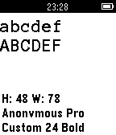

A very clean monospaced font.  Designed with coding in mind.  Released under the Open Font License version 1.1 ([OFL]).

### [Bitham](http://www.typography.com/fonts/gotham/overview/) by the Hoefler & Frere-Jones Type Foundry

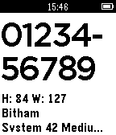

Bitham is a renamed Gotham font and is built-in to Pebble.  The TTF files are not not in this project because the font is not freely available.

### [Digit](http://www.dafont.com/digit.font) by paldave

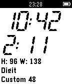

Digital clock based font with readable letters.  Monospaced.  Source cites "100% Free".

### [Droid](https://github.com/android/platform_frameworks_base/tree/master/data/fonts) by Steve Matteson

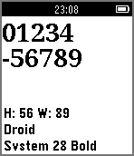

Droid is a font that comes with the Pebble.  This font family was created for small screens of mobile devices.  They are licensed under the Apache License version 2.0 ([APACHE]).

### [Fjalla](http://www.fontsquirrel.com/fonts/fjalla) by Sorkin Type Co

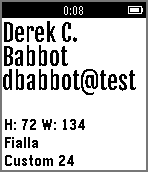

This is a condensed, medium contrast bold font, suitable for use in headlines.  It is licensed under the Open Font License version 1.1 ([OFL]).

### [Gothic](http://www.myfonts.com/fonts/marksimonson/raster-gothic/) by Mark Simonson

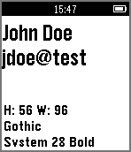

Raster Gothic (or, as known on the Pebble, Gothic) was created as a series of outline fonts that retain the aliased look of a bitmap font.  It's clarity and crispness are why it's added to the Pebble by default.  This is not a free font and its TTF files are not included in this project.

### [Merriweather](http://www.fontsquirrel.com/fonts/merriweather) by Eben Sorkin

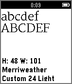

Merriweather is designed for better text readability and is slightly condensed.  It is licensed under the Open Font License version 1.1 ([OFL]).

### [Nevis](http://tenbytwenty.com/?xxxx_posts=nevis) by Ed Merritt

Nevis is a strong, angular typeface and is ideal for headings & buttons. It's assertive and bold, but manages to retain a friendly tone, and looks especially good when used in all caps.  The web page hosting it lists this font as free.

### [Noticia Text](http://www.fontsquirrel.com/fonts/noticia-text) by José Miguel Solé

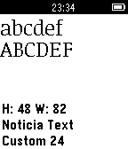

Readable font designed for print and black & white applications.  Released under the Open Font License version 1.1 ([OFL]).

### [Open Sans Condensed](https://www.google.com/fonts/specimen/Open+Sans+Condensed) by Steve Matteson

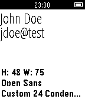

Designed with an upright stress, open forms and a neutral, yet friendly appearance.  Optimized for print, web, and mobile interfaces with excellent legibility characteristics in its letterforms.  Released under the Apache License version 2.0 ([APACHE]).

### [OSP-DIN](http://ospublish.constantvzw.org/foundry/osp-din/) by OSP

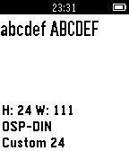

Based on 1932 drawings of the DIN 1451 typeface seen during a trip to Berlin.  This font was used in an example by Pebble.  Licensed under the Open Font License version 1.1 ([OFL]).

### [Pendule Ornamental](http://fontstruct.com/fontstructions/show/pendule_ornamental) by Scott Lawrence

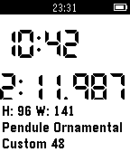

This specialized ornamental/display font has been created explicitly for use in a digital clock. Two different styles of digits are provided with as A-P and a-p. The digits 0-9, and A-F, as seen on LCD and LED displays are included, along with colon(:), decimal(.) point, and negative sign (-).  Released under the Creative Commons Attribution-ShareALike 3.0 License ([CC-ASL]).

### [Phonebook](http://www.1001freefonts.com/phonebook.font) by Manfred Klein

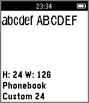

Slightly heavier and condensed to fit more words horizontally.  License according to sources all cite it is free.  Font is not listed on Klein's [official site](http://manfred-klein.ina-mar.com/), but all of his other fonts request that a donation is made when used for commercial use.

### [Roboto](http://www.google.com/fonts/specimen/Roboto) by Christian Robertson

Designed around the requirements of UI and high-resolution screens.  Distributed in Android since Ice Cream Sandwich.  Used in Pebble already but more variants are listed in this app.  Licensed under the Apache License version 2.0 ([APACHE]).

### [Segment 7](http://openfontlibrary.org/en/font/segment7) by Cedric Knight

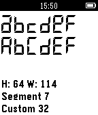

Strictly seven-segment (plus point) calculator display face, fixed-width and free. Other LED/LCD digital fonts may kern or include paths that are not available with seven segments in order to represent characters better. Segment7 does the best it can for upper- and lower-case Latin without compromising on the true LED display appearance.  Released under Open Font License version 1.1 ([OFL]).

### [Source Sans Pro](https://github.com/adobe-fonts/source-sans-pro) by Paul D. Hunt

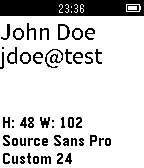

This is a sans serif typeface intended to work well in user interfaces.  Simplified glyph designs were based off Gothic fonts and additional details were added to easily distinguish letters.  Reads well for short strings and extended settings.  Released under the Open Font License version 1.1 ([OFL]).

### [UniCons](http://openfontlibrary.org/font/unicons) by Juergen Kraus

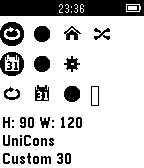

A monospaced font consisting of common user interface symbols.  Licensed under the Open Font License version 1.1 ([OFL]).

More Fonts?
-----------

Do you have one that you would like to include?  Drop me a line by filing a [feature request](https://github.com/fidian/pebble-fontastic/issues) or post in the [forum discussion].  Please keep in mind that only so many custom fonts can be included in the application because there's a hard limit of 96k of resources allowed.

License Information
-------------------

The original example was listed under the MIT license.  This one is licensed under the same.  See [LICENSE.md](LICENSE.md) for the full text.

Fonts are licensed under multiple licenses.  For convenience, each font cites their license and here is the text of every license used:

* Apache License version 2 - [APACHE]
* Creative Commons Attribution-ShareALike License version 3.0 - [CC-ASL]
* Open Font License version 1.1 - [OFL]

[APACHE]: APACHE.md
[app_font_browser]: https://github.com/pebble/pebble-sdk-examples/tree/master/watchapps/app_font_browser
[CC-ASL]: CC-ASL.md
[CloudPebble]: https://cloudpebble.net/
[Forum Discussion]: http://forums.getpebble.com/discussion/18957
[OFL]: OFL.md
